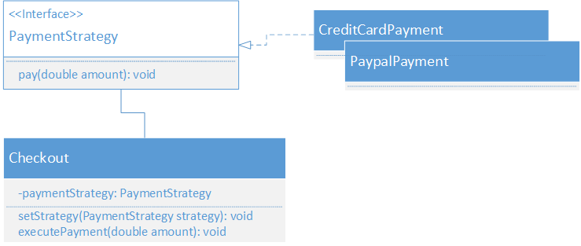
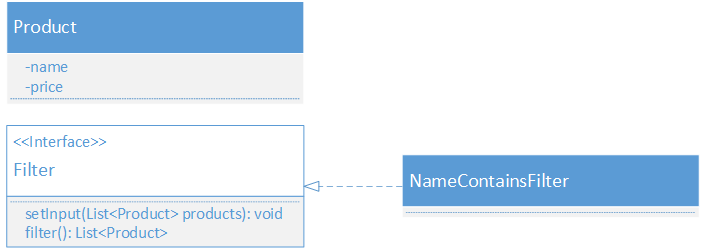

## 🧠 Wzorce projektowe: Strategia i Filtr w Javie

Wzorce projektowe pomagają pisać elastyczny, łatwy w utrzymaniu kod. Poniżej omawiamy dwa popularne wzorce, które świetnie współgrają z interfejsami w Javie.

---

### 🧩 Wzorzec Strategia (Strategy)

#### 📌 Cel:

Oddzielenie algorytmu od obiektu, który z niego korzysta. Dzięki temu możemy dynamicznie zmieniać sposób działania programu.

#### 📐 Struktura:

* Interfejs strategii definiuje wspólne metody dla różnych wariantów zachowań.
* Różne klasy implementują ten interfejs, dostarczając konkretne strategie.
* Klasa kontekstowa posiada odniesienie do strategii i deleguje jej wywołania.

#### 🧪 Przykład:



```java
public interface PaymentStrategy {
    void pay(double amount);
}

public class CreditCardPayment implements PaymentStrategy {
    public void pay(double amount) {
        System.out.println("Płacę kartą: " + amount);
    }
}

public class PayPalPayment implements PaymentStrategy {
    public void pay(double amount) {
        System.out.println("Płacę przez PayPal: " + amount);
    }
}

public class Checkout {
    private PaymentStrategy strategy;

    public void setStrategy(PaymentStrategy strategy) {
        this.strategy = strategy;
    }

    public void executePayment(double amount) {
        strategy.pay(amount);
    }
}
```

#### 🧪 Użycie:

```java
Checkout checkout = new Checkout();
checkout.setStrategy(new CreditCardPayment());
checkout.executePayment(100.0);

checkout.setStrategy(new PayPalPayment());
checkout.executePayment(75.0);
```

#### 💡 Wynik w terminalu:

```
Płacę kartą: 100.0
Płacę przez PayPal: 75.0
```

---

### 🔍 Wzorzec Filtr (Specification / Filter)

#### 📌 Cel:

Oddzielenie logiki filtrowania danych od kolekcji, które są filtrowane.

#### 📐 Struktura:

* Interfejs `Filter` z metodami do ustawiania danych wejściowych i filtrowania.
* Implementacje, które definiują różne kryteria filtrowania (np. po cenie, dacie, słowie kluczowym).
* Możliwość łączenia filtrów (kompozycja).

#### 🧪 Przykład:



```java
public class Product {
    private String name;
    private double price;

    public Product(String name, double price) {
        this.name = name;
        this.price = price;
    }

    public String getName() {
        return name;
    }

    public double getPrice() {
        return price;
    }
}

public interface Filter {
    void setInput(List<Product> products);
    List<Product> filter();
}

public class NameContainsFilter implements Filter {
    private List<Product> products;
    private String keyword;

    public NameContainsFilter(String keyword) {
        this.keyword = keyword;
    }

    public void setInput(List<Product> products) {
        this.products = products;
    }

    public List<Product> filter() {
        List<Product> result = new ArrayList<>();
        for (Product product : products) {
            if (product.getName().contains(keyword)) {
                result.add(product);
            }
        }
        return result;
    }
}
```

#### 🧪 Użycie:

```java
List<Product> products = List.of(
    new Product("Laptop Lenovo", 3000),
    new Product("Mysz Logitech", 150),
    new Product("Klawiatura", 200)
);

Filter filter = new NameContainsFilter("Log");
filter.setInput(products);
List<Product> result = filter.filter();
for (Product p : result) {
    System.out.println(p.getName() + " - " + p.getPrice());
}
```

#### 💡 Wynik w terminalu:

```
Mysz Logitech - 150.0
```

---

### 🧠 Rola interfejsów

Interfejsy umożliwiają:

* definiowanie wspólnego typu dla wielu strategii / filtrów,
* łatwą zamianę implementacji bez zmiany kodu korzystającego z interfejsu,
* stosowanie **polimorfizmu**, co prowadzi do elastycznego, modularnego kodu.

---

## 🏁 Podsumowanie

| Wzorzec   | Cel                              | Rola interfejsu                     |
| --------- | -------------------------------- | ----------------------------------- |
| Strategia | Dynamiczna zmiana zachowania     | Definicja różnych wariantów logiki  |
| Filtr     | Separacja kryteriów wyszukiwania | Zmienność implementacji filtrowania |

Dzięki interfejsom oba wzorce stają się bardzo silnym narzędziem w tworzeniu przejrzystej, łatwej do modyfikacji architektury. 🚀
